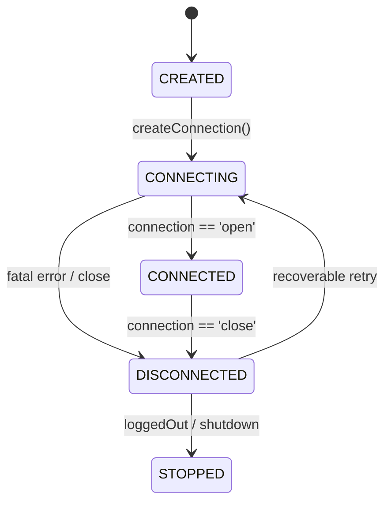

# Phase 3B: ConnectionManager + Database-Backed Baileys Authentication

This document details the design, architecture, database schemas, and runtime integration implemented in **Phase 3B** of the **Windowseven MD** multi-tenant SaaS platform.

---

## 1. Architecture Transition: Before & After

### Before Phase 3B (Legacy Single-Account Runtime)
```text
index.js
   ├── useMultiFileAuthState('./session')  <-- Unmanaged disk storage
   └── makeWASocket(...)                   <-- Single unmanaged global socket
          └── main.js
                 └── commands/*
```

### After Phase 3B (ConnectionManager + DB Auth)
```text
index.js (Runtime Entrypoint)
   ├── verifyRequiredSchema()             <-- Verifies schema exists (fails closed)
   ├── bootstrapTransitionalConnection()   <-- Idempotent transitional identity
   │
   ▼
ConnectionManager (Lifecycle Owner)
   │
   ├── Map<connectionId, RuntimeConnection>
   │
   ├── useDatabaseAuthState(tenantId, connectionId)
   │      ├── WhatsAppAuthCredentialsRepository (PostgreSQL)
   │      └── WhatsAppAuthKeysRepository (PostgreSQL)
   │
   ├── makeWASocket(...)                   <-- Sole socket factory
   │
   └── Temporary Legacy Event Bridge
          └── main.js (handleMessages, handleGroupParticipantUpdate, handleStatus)
```

---

## 2. ConnectionManager Responsibilities

Located at [`src/whatsapp/ConnectionManager.js`](file:///Users/furahamogela/Desktop/WINDOWSEVEN/WHATSAPP-BOT/src/whatsapp/ConnectionManager.js), the manager is responsible for:
- **Registration & Ownership**: Validates that every connection belongs to its declared tenant against PostgreSQL before socket initialization.
- **Socket Factory**: Sole authoritative location in the codebase calling `makeWASocket(...)`.
- **Runtime Registry**: Maintains active `RuntimeConnection` instances in memory.
- **Reconnect Policy**: Controlled exponential backoff with jitter and fatal disconnect classification.
- **Failure Isolation**: Isolates socket failures and errors so one connection crashing does not affect other tenants or connections.
- **Status Synchronization**: Reflects runtime transitions in the PostgreSQL `whatsapp_connections` table.
- **Graceful Shutdown**: Unregisters connections, clears reconnect timers, ends sockets, and releases database resources cleanly.

---

## 3. RuntimeConnection Model

Each active connection in `ConnectionManager.connections` holds:
```javascript
{
    tenantId: string,              // UUID of tenant
    connectionId: string,          // UUID of connection
    socket: WASocket,              // Managed Baileys socket instance
    status: string,                // 'CREATED' | 'CONNECTING' | 'CONNECTED' | 'DISCONNECTED'
    lifecycleState: string,        // 'STARTING' | 'RUNNING' | 'RECONNECTING' | 'STOPPED' | 'FAILED'
    reconnectTimer: Timeout|null,  // Active reconnect timer if scheduled
    reconnectAttempts: number,     // Current sequential retry attempt
    options: object,               // Custom options (eventBridge, socketOverrides)
    saveCreds: Function,           // Bound credentials persistence function
    state: object                  // { creds, keys } Baileys auth state
}
```

---

## 4. Connection Lifecycle & Status Synchronization



Every lifecycle event synchronizes the status back to PostgreSQL via `WhatsAppConnectionRepository.updateStatusForTenant(connectionId, tenantId, status)`.

---

## 5. Reconnect Policy & Fatal Disconnect Classification

- **Fatal Disconnects**:
  - `DisconnectReason.loggedOut` (HTTP 401)
  - `DisconnectReason.badSession`
  - *Action*: Reconnect is **aborted**. Credentials are deleted on `loggedOut`. Status is set to `DISCONNECTED`.
- **Recoverable Disconnects**:
  - `connectionClosed`, `connectionLost`, `timedOut`, `restartRequired`
  - *Action*: Exponential backoff with random jitter:
    $$\text{Delay} = \min(1000 \times 2^{\text{attempt} - 1} + \text{jitter}, 30000)$$
  - Maximum retry attempts: `5`. If exceeded, connection transitions to `FAILED`.

---

## 6. Failure Isolation

In multi-tenant setups:
```text
Tenant A
 ├── Connection A1
 └── Connection A2

Tenant B
 └── Connection B1
```
- Socket listeners wrap error-prone calls in `try/catch` and sanitize log output.
- A failure, crash, or disconnect on Connection A1:
  - Does **not** close Connection A2.
  - Does **not** close Connection B1.
  - Does **not** modify or delete A2 or B1's registry entries or database status.
  - Does **not** crash the parent Node.js process.

---

## 7. Baileys AuthenticationState & Database Design

Migration [`src/database/migrations/002_whatsapp_auth.up.sql`](file:///Users/furahamogela/Desktop/WINDOWSEVEN/WHATSAPP-BOT/src/database/migrations/002_whatsapp_auth.up.sql) introduces two tables:

### 1. `whatsapp_auth_credentials`
- `connection_id` (UUID, Primary Key)
- `tenant_id` (UUID, NOT NULL)
- `credentials` (TEXT, NOT NULL)
- `created_at`, `updated_at` (TIMESTAMPTZ)
- `CONSTRAINT fk_auth_creds_connection_tenant FOREIGN KEY (tenant_id, connection_id) REFERENCES whatsapp_connections(tenant_id, id) ON DELETE CASCADE`

### 2. `whatsapp_auth_keys`
- `id` (UUID, Primary Key)
- `connection_id` (UUID, NOT NULL)
- `tenant_id` (UUID, NOT NULL)
- `key_type` (VARCHAR(100), NOT NULL)
- `key_id` (VARCHAR(255), NOT NULL)
- `key_value` (TEXT, NOT NULL)
- `created_at`, `updated_at` (TIMESTAMPTZ)
- `CONSTRAINT fk_auth_keys_connection_tenant FOREIGN KEY (tenant_id, connection_id) REFERENCES whatsapp_connections(tenant_id, id) ON DELETE CASCADE`
- `CONSTRAINT uq_auth_keys_conn_type_id UNIQUE (connection_id, key_type, key_id)`

---

## 8. Serialization Strategy (`BufferJSON`)

Baileys authentication state contains binary data (`Buffer`, `Uint8Array`) and protocol buffers.
- Serialization uses `BufferJSON.replacer`, converting buffers into `{ type: 'Buffer', data: '<base64>' }`.
- Deserialization uses `BufferJSON.reviver`, reconstructing original `Buffer` instances with byte-level fidelity.
- Special handling for `app-state-sync-key`: transformed via `proto.Message.AppStateSyncKeyData.fromObject(value)`.

---

## 9. Fail-Closed Security Semantics

`useDatabaseAuthState` strictly enforces fail-closed operations:
1. **No Row Exists**: Initializes fresh credentials using `initAuthCreds()` and writes the initial row to PostgreSQL.
2. **Row Exists**: Deserializes and returns existing credentials.
3. **Database Error**: Throws immediately. Never falls back to `initAuthCreds()`.
4. **Corrupted Data**: If stored credentials exist but cannot be parsed, throws a `CorruptedAuthError`. Never silently replaces corrupted credentials with fresh ones.
5. **No Secret Logging**: Credentials and private keys are never printed in console logs or error messages.

---

## 10. Startup Recovery & Idempotent Bootstrap

1. **Schema Check**: `verifyRequiredSchema(pool)` ensures tables exist without running migrations automatically. If tables are missing, startup aborts asking the administrator to run `npm run db:migrate`.
2. **Idempotent Bootstrap**: [`src/whatsapp/bootstrap.js`](file:///Users/furahamogela/Desktop/WINDOWSEVEN/WHATSAPP-BOT/src/whatsapp/bootstrap.js) queries or creates the transitional workspace and connection without creating duplicates across process restarts.

---

## 11. Legacy Runtime Bridge & Session Preservation

- **Legacy Bridge**: [`src/whatsapp/legacyBridge.js`](file:///Users/furahamogela/Desktop/WINDOWSEVEN/WHATSAPP-BOT/src/whatsapp/legacyBridge.js) bridges events from the managed socket to `handleMessages`, `handleGroupParticipantUpdate`, and `handleStatus`.
- **Legacy Session**: The existing `./session` filesystem folder is preserved untouched (never silently deleted or modified). The new DB-backed connection uses PostgreSQL.

---

## 12. Verification & Test Strategy

Executed with `npm test` (`node --test --test-concurrency=1 test/**/*.test.js`):
- **40 tests across 7 suites passed with 0 failures**.
- Test suites:
  1. `baileys_auth.test.js`: Credential persistence, Buffer fidelity, key batching/deletion, tenant isolation, restart persistence, fail-closed corrupted data rejection, DB error fail-closed rejection.
  2. `connection_manager.test.js`: Registration, duplicate rejection, tenant validation, multi-connection failure isolation, fatal vs recoverable reconnect classification, graceful shutdown.
  3. `migration_and_schema.test.js`: Migration UP -> DOWN -> UP lifecycle, composite foreign keys, case-insensitive email uniqueness.
  4. `tenant_isolation.test.js`: Cross-tenant read/update/delete denial, forged ID rejection.
  5. `command_security.test.js`: Legacy command security baselines.
  6. `config.test.js`: Configuration baselines.
  7. `security.test.js`: Environment and sanitized data checks.

---

## 13. Known Limitations & Deferred Phase 3C Work

- **Real WhatsApp Device Verification**: No physical mobile device was paired during local testing; structural, serialization, lifecycle, and unit/integration verification was executed. Real pairing with a physical device will be verified in staging.
- **Deferred to Phase 3C**:
  - EventAdapter: Decoupling `main.js` from direct Baileys event signatures.
  - Context Injection: Full `(tenantId, connectionId)` contextual command execution.
  - Moderation Services: Refactoring antilink, antibadword, and warning state into PostgreSQL-backed services.
