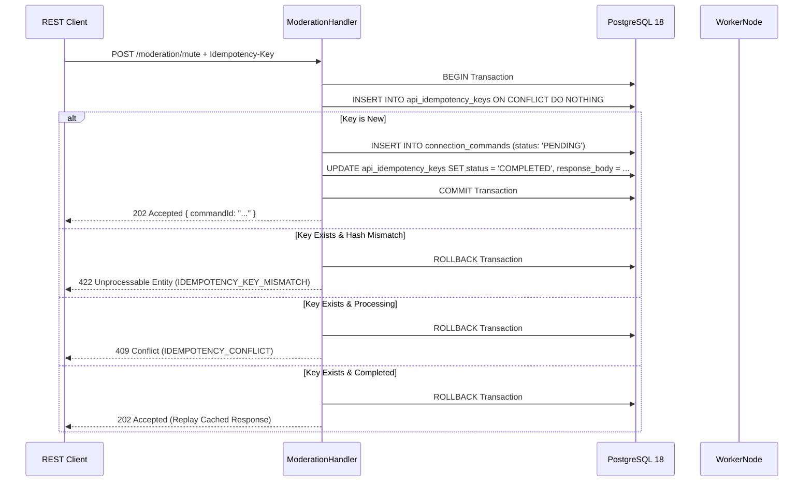

# 12. Group Policy, Moderation REST APIs & Durable Scheduling

## Phase 4E Architecture & Implementation Specification

---

## 1. Executive Summary

Phase 4E establishes the operational group management, policy enforcement, and asynchronous moderation subsystem for **Windowseven MD**. It bridges the multi-tenant REST application plane to the distributed WhatsApp worker plane via PostgreSQL 18-backed durable commands and crash-resilient moderation scheduling.

### Core Architectural Guarantees

1. **Authoritative State in PostgreSQL 18**: No Redis, BullMQ, Kafka, or external broker dependencies. PostgreSQL transactions guarantee linearizability, claim fencing, and durability.
2. **Dual-Gate Moderation Authorization**:
   - **Gate 1 (REST HTTP Plane)**: Evaluates JWT, tenant membership, hierarchical RBAC (Owner/Admin), target group status (`MANAGED`), and connection state (`ACTIVE`).
   - **Gate 2 (Worker Plane)**: Evaluates runtime WhatsApp bot privileges (`isBotAdmin`), active socket liveness, and ownership lease epochs prior to executing WhatsApp mutations.
3. **Monotonic Worker Claim Fencing**: All command claims and scheduled task claims are strictly fenced by `(worker_id, claim_epoch)`. Stale workers with expired or superseded epochs cannot commit status transitions or schedule follow-up actions (0 rows affected).
4. **Timing Origin Integrity for Durable Mutes**: Scheduled unmutes compute `run_at = executed_at + duration_minutes`, guaranteeing that execution timing originates from actual WhatsApp execution timestamp rather than API receipt time.
5. **Atomic MUTE Replacement Semantics**: A new `MUTE_GROUP` command atomically marks previous pending scheduled unmutes as `CANCELLED` inside the same database transaction.
6. **API Idempotency with Canonical Hashing**: Modifying REST requests with an `Idempotency-Key` header are protected against network retries using atomic reservation and cached replay.

---

## 2. Database Schema & Migration 006

Migration `006_policy_moderation_and_durable_commands` introduces three relational tables and composite uniqueness constraints:

```sql
-- 1. Relational Integrity: Enforce composite uniqueness on groups
ALTER TABLE groups 
    DROP CONSTRAINT IF EXISTS uq_groups_tenant_connection_id;
ALTER TABLE groups 
    ADD CONSTRAINT uq_groups_tenant_connection_id UNIQUE (tenant_id, connection_id, id);

-- 2. api_idempotency_keys: Atomic reservation & replay caching
CREATE TABLE IF NOT EXISTS api_idempotency_keys (
    id UUID PRIMARY KEY DEFAULT gen_random_uuid(),
    tenant_id UUID NOT NULL REFERENCES tenants(id) ON DELETE CASCADE,
    user_id UUID NOT NULL REFERENCES users(id) ON DELETE CASCADE,
    idempotency_key VARCHAR(64) NOT NULL,
    request_hash VARCHAR(64) NOT NULL,
    status VARCHAR(50) NOT NULL DEFAULT 'PENDING' CHECK (status IN ('PENDING', 'COMPLETED')),
    response_status_code INT,
    response_body JSONB,
    created_at TIMESTAMPTZ NOT NULL DEFAULT NOW(),
    expires_at TIMESTAMPTZ NOT NULL DEFAULT NOW() + INTERVAL '24 hours',
    CONSTRAINT uq_api_idempotency_tenant_user_key UNIQUE (tenant_id, user_id, idempotency_key)
);

-- 3. connection_commands: Durable asynchronous worker commands
CREATE TABLE IF NOT EXISTS connection_commands (
    id UUID PRIMARY KEY DEFAULT gen_random_uuid(),
    tenant_id UUID NOT NULL,
    connection_id UUID NOT NULL,
    group_id UUID,
    command_type VARCHAR(50) NOT NULL CHECK (command_type IN (
        'SYNC_GROUPS', 'MUTE_GROUP', 'UNMUTE_GROUP', 'KICK_PARTICIPANT'
    )),
    payload JSONB NOT NULL DEFAULT '{}'::jsonb,
    requested_by_user_id UUID REFERENCES users(id) ON DELETE SET NULL,
    status VARCHAR(50) NOT NULL DEFAULT 'PENDING' CHECK (status IN (
        'PENDING', 'PROCESSING', 'COMPLETED', 'FAILED', 'CANCELLED'
    )),
    attempt_count INT NOT NULL DEFAULT 0,
    max_attempts INT NOT NULL DEFAULT 3,
    last_attempt_at TIMESTAMPTZ,
    next_attempt_at TIMESTAMPTZ NOT NULL DEFAULT NOW(),
    claimed_by_worker_id VARCHAR(100),
    claim_epoch BIGINT,
    claim_expires_at TIMESTAMPTZ,
    executed_at TIMESTAMPTZ,
    result JSONB,
    last_error TEXT,
    created_at TIMESTAMPTZ NOT NULL DEFAULT NOW(),
    updated_at TIMESTAMPTZ NOT NULL DEFAULT NOW(),
    CONSTRAINT fk_connection_commands_conn_tenant FOREIGN KEY (tenant_id, connection_id)
        REFERENCES whatsapp_connections(tenant_id, id) ON DELETE CASCADE,
    CONSTRAINT fk_connection_commands_group FOREIGN KEY (tenant_id, connection_id, group_id)
        REFERENCES groups(tenant_id, connection_id, id) ON DELETE CASCADE
);

-- 4. scheduled_moderation_tasks: Crash-resilient scheduled unmutes
CREATE TABLE IF NOT EXISTS scheduled_moderation_tasks (
    id UUID PRIMARY KEY DEFAULT gen_random_uuid(),
    tenant_id UUID NOT NULL,
    group_id UUID NOT NULL,
    connection_id UUID NOT NULL,
    action VARCHAR(50) NOT NULL CHECK (action IN ('UNMUTE_GROUP')),
    payload JSONB NOT NULL DEFAULT '{}'::jsonb,
    run_at TIMESTAMPTZ NOT NULL,
    status VARCHAR(50) NOT NULL DEFAULT 'PENDING' CHECK (status IN (
        'PENDING', 'PROCESSING', 'COMPLETED', 'FAILED', 'CANCELLED'
    )),
    attempt_count INT NOT NULL DEFAULT 0,
    max_attempts INT NOT NULL DEFAULT 3,
    last_attempt_at TIMESTAMPTZ,
    next_attempt_at TIMESTAMPTZ NOT NULL DEFAULT NOW(),
    claimed_by_worker_id VARCHAR(100),
    claim_epoch BIGINT,
    claim_expires_at TIMESTAMPTZ,
    executed_at TIMESTAMPTZ,
    last_error TEXT,
    created_at TIMESTAMPTZ NOT NULL DEFAULT NOW(),
    updated_at TIMESTAMPTZ NOT NULL DEFAULT NOW(),
    CONSTRAINT fk_scheduled_moderation_group_conn FOREIGN KEY (tenant_id, connection_id, group_id)
        REFERENCES groups(tenant_id, connection_id, id) ON DELETE CASCADE
);
```

---

## 3. REST API Contracts & Endpoint Catalog

### 3.1 Groups API

| Method | Path | RBAC | Description |
| :--- | :--- | :--- | :--- |
| `GET` | `/api/v1/tenants/:tenantId/connections/:connectionId/groups` | `MEMBER` | Lists discovered groups with status filtering (`?status=MANAGED`) and pagination. |
| `GET` | `/api/v1/tenants/:tenantId/groups/:groupId` | `MEMBER` | Returns full group details along with its active policy configuration. |
| `PATCH` | `/api/v1/tenants/:tenantId/groups/:groupId/status` | `ADMIN` | Toggles group status (`MANAGED` vs `UNMANAGED`). Cancels scheduled tasks on unmanage. |
| `POST` | `/api/v1/tenants/:tenantId/connections/:connectionId/groups/sync` | `ADMIN` | Enqueues a durable `SYNC_GROUPS` command to refresh group metadata from WhatsApp. |

### 3.2 Policy API

| Method | Path | RBAC | Description |
| :--- | :--- | :--- | :--- |
| `GET` | `/api/v1/tenants/:tenantId/groups/:groupId/policies` | `MEMBER` | Retrieves the active policy configuration (or default fallback). |
| `PUT` | `/api/v1/tenants/:tenantId/groups/:groupId/policies` | `ADMIN` | Upserts policy with strict JSONB validation (max 16KB, secret key rejection, unknown field rejection). |

#### Policy Validation Rules (`PolicyValidator`)
- **Group Status Guard**: Target group must be in `MANAGED` status; returns `400 GROUP_NOT_MANAGED` otherwise.
- **Top-Level Allowlist**: Accepts camelCase and snake_case properties (`antilink_enabled`, `antilink_action`, `antibadword_enabled`, `antibadword_action`, `max_warnings`, `warning_action`, `welcome_enabled`, `welcome_message`, `goodbye_enabled`, `goodbye_message`, `chatbot_enabled`, `settings`).
- **Identity Key Protection**: Explicitly rejects mutations to `id`, `tenant_id`, `connection_id`, `created_at`, `updated_at` with `422 VALIDATION_ERROR`.
- **Settings Payload**: Maximum size is 16KB. Recursively scanned for sensitive patterns (`token`, `secret`, `password`, `auth`, `private`). Violations result in `422 VALIDATION_ERROR`.

### 3.3 Warnings API

| Method | Path | RBAC | Description |
| :--- | :--- | :--- | :--- |
| `GET` | `/api/v1/tenants/:tenantId/groups/:groupId/warnings` | `MEMBER` | Lists paginated warnings issued in the group. |
| `POST` | `/api/v1/tenants/:tenantId/groups/:groupId/warnings` | `ADMIN` | Issues a warning with transactional concurrency locking, atomic escalation, and native `Idempotency-Key` support. |
| `DELETE` | `/api/v1/tenants/:tenantId/groups/:groupId/warnings` | `ADMIN` | Resets warnings for a specific participant (`?subjectJid=...`) or entire group. |

#### Advisory Locking, Atomic Escalation & Idempotency Protocol
- **Idempotency-Key Integration**: Supports `Idempotency-Key` header with canonical request hashing (`computeRequestHash`). Atomic reservation, replay caching (`X-Cache: IDEMPOTENT-REPLAY`), and 422 payload mismatch rejection.
- **Single Transaction Boundary**: Idempotency key reservation, subject-level advisory lock (`pg_advisory_xact_lock`), warning record creation, threshold count evaluation, escalation kick command creation (`KICK_PARTICIPANT`), and idempotency key completion (`completeKey`) participate in the **exact same PostgreSQL transaction**.
- **Advisory Lock**: Issues `SELECT pg_advisory_xact_lock(hashtext(tenantId || ':' || groupId || ':' || subjectJid))` to serialize concurrent warning mutations for the same participant.
- **Atomic Escalation**: If `warningCount >= maxWarnings`, atomically creates a `KICK_PARTICIPANT` command in `connection_commands`. All operations commit or rollback together.

### 3.4 Moderation API

All moderation mutation endpoints return `202 Accepted` with a durable `commandId`:

| Method | Path | RBAC | Description |
| :--- | :--- | :--- | :--- |
| `POST` | `/api/v1/tenants/:tenantId/groups/:groupId/moderation/mute` | `ADMIN` | Enqueues durable `MUTE_GROUP` command (supports optional `durationMinutes`). |
| `POST` | `/api/v1/tenants/:tenantId/groups/:groupId/moderation/unmute` | `ADMIN` | Enqueues durable `UNMUTE_GROUP` command. |
| `POST` | `/api/v1/tenants/:tenantId/groups/:groupId/moderation/kick` | `ADMIN` | Enqueues durable `KICK_PARTICIPANT` command (`participantJid` required). |

### 3.5 Command Polling API

| Method | Path | RBAC | Description |
| :--- | :--- | :--- | :--- |
| `GET` | `/api/v1/tenants/:tenantId/commands/:commandId` | `MEMBER` | Polls the durable execution state, retry count, and result of an asynchronous command. |

---

## 4. API Idempotency Implementation

Clients can safely retry mutating moderation requests by sending an `Idempotency-Key` header:

```http
POST /api/v1/tenants/{tenantId}/groups/{groupId}/moderation/mute HTTP/1.1
Idempotency-Key: e8e6c753-ff62-4217-bfd2-b133827ad288
Content-Type: application/json

{
  "durationMinutes": 60,
  "reason": "Overnight group maintenance"
}
```

### Execution Lifecycle



---

## 5. Distributed Worker Plane & Claim Fencing

Workers claim pending commands and scheduled tasks using row-level locking (`FOR UPDATE SKIP LOCKED`):

```sql
SELECT id, attempt_count, max_attempts
FROM connection_commands
WHERE connection_id = $1
  AND (
      (status = 'PENDING' AND next_attempt_at <= NOW())
      OR
      (status = 'PROCESSING' AND claim_expires_at < NOW())
  )
ORDER BY created_at ASC
LIMIT 1
FOR UPDATE SKIP LOCKED;
```

### Claim Transition & Fencing Invariant
1. On claim, `status` transitions to `PROCESSING`, assigning `claimed_by_worker_id`, setting `claim_epoch`, and extending `claim_expires_at = NOW() + INTERVAL '30 seconds'`.
2. When the worker finishes WhatsApp execution, it executes:
   ```sql
   UPDATE connection_commands
   SET status = 'COMPLETED', executed_at = NOW(), result = $4, updated_at = NOW()
   WHERE id = $1 AND status = 'PROCESSING' AND claimed_by_worker_id = $2 AND claim_epoch = $3;
   ```
3. If a worker suffered a network pause or lease expiration and its `claim_epoch` was superseded, the query matches `0` rows. The stale worker's completion is safely ignored, preventing split-brain state corruptions.

---

## 6. Durable Moderation Scheduler

The `DurableModerationScheduler` runs as a resilient background component on active workers:

1. **Eligible Task Polling**: Selects tasks with `action = 'UNMUTE_GROUP'`, `status = 'PENDING'`, `run_at <= NOW()`, and `next_attempt_at <= NOW()`.
2. **Epoch Verification**: Re-checks worker connection lease epoch before executing socket operations.
3. **Pre-Gateway Cancellation Check**: Validates that target group is still `MANAGED`. If the group was switched to `UNMANAGED`, the scheduler marks the task `CANCELLED` and aborts external WhatsApp dispatch.
4. **WhatsApp Dispatch**: Calls Baileys socket `groupSettingUpdate(groupJid, 'not_announcement')` and emits announcement message.
5. **Fenced Completion**: Updates task status to `COMPLETED` filtered by `claim_epoch`.

---

## 7. Verification Proofs & Metrics

- **Total Test Suites**: 54 suites passing.
- **Total Tests**: 256 tests passing (100% pass rate).
- **Targeted Phase 4E Tests**: 42 tests passing (including 6 dedicated Warning Idempotency Integration tests).
- **Test Failures / Skipped**: 0 failures, 0 skipped.
- **Frontend State**: Untouched (preserved throughout Phase 4E).
- **External Dependencies**: Zero added. Single authoritative store remains PostgreSQL 18.
