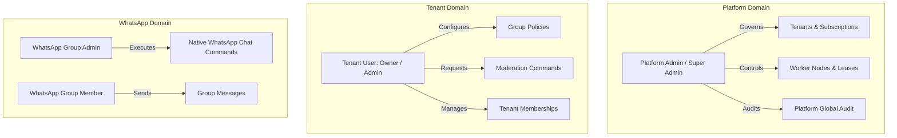
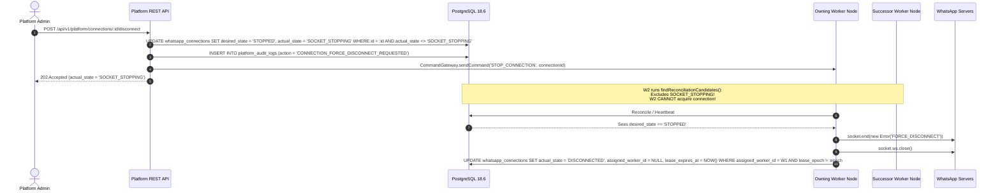
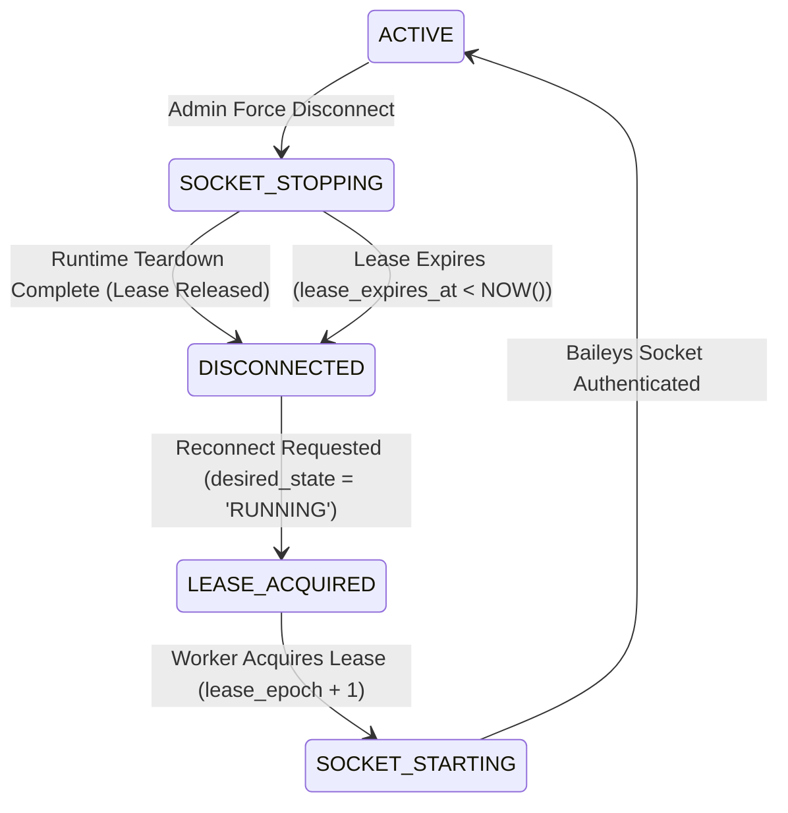

# Phase 4F: Platform Administration & Operations Architecture Specification

```text
SYSTEM:
Windowseven MD — Multi-Tenant WhatsApp Group Management SaaS

COMPONENT:
Phase 4F Platform Administration & Operations Layer

STATUS:
Corrected Architecture Specification (Closure Pass — Strictly Pre-Implementation)

POSTGRESQL BASELINE:
18.6 with Migrations 001 through 007 applied and verified

BAILEYS RUNTIME:
@whiskeysockets/baileys@7.0.0-rc14 (VERIFIED in package.json)
```

---

## 1. Executive Summary & Epistemic Classification

Windowseven MD is evolving from a single-tenant WhatsApp bot into an enterprise multi-tenant WhatsApp group-management SaaS platform. The system operates on a clear hierarchy of concerns:
- **Stateless REST & WebSocket Gateway Plane**: Serves authenticated client APIs and streams real-time state projections.
- **Authoritative Persistence Plane (PostgreSQL 18.6)**: Holds all persistent state, row-level locks, composite foreign key constraints, and monotonic fencing tokens.
- **Distributed Worker Plane**: Manages active Baileys WhatsApp sockets, executes asynchronous background moderation commands, and drives timed moderation schedules.

**Phase 4F** introduces the **Platform Administration & Operations** subsystem. This subsystem provides platform operators with the tooling required to inspect, govern, configure, and maintain the SaaS platform across all tenant boundaries—without confusing platform authority with customer tenant authority or WhatsApp group authority.

### Epistemic Classification of Claims

To preserve forensic engineering integrity, every statement in this specification is categorized as follows:
- **`[VERIFIED]`**: Established directly from repository code, PostgreSQL schema, or passing test suites.
- **`[DESIGNED]`**: Explicit architectural decisions, state machines, and protocols defined for Phase 4F.
- **`[MEASURED]`**: Empirical benchmarks gathered under measured workloads.
- **`[INITIAL CAPACITY ASSUMPTION]`**: Unverified sizing hints or default parameters that must not be treated as production guarantees.
- **`[PRODUCT DECISION]`**: Deliberate business or policy rule established for the product.
- **`[OPEN DECISION]`**: Unresolved design questions requiring trade-off evaluation.
- **`[UNKNOWN]`**: Inherent distributed-systems limits that software cannot prove or guarantee.

---

## 2. Current Repository Baseline

`[VERIFIED]` A forensic audit of the codebase establishes the following technical baseline:

- **Runtime & Language**: Node.js Native HTTP server; ES2022 JavaScript.
- **Database Engine**: PostgreSQL 18.6 with 7 applied and verified migrations (`001_initial_schema` to `007_worker_fencing_and_remote_outcomes`).
- **Cryptographic Security**: Ed25519 asymmetric access JWTs (RFC 8037 EdDSA, 15-minute TTL) with opaque rotating refresh tokens backed by PostgreSQL token-family fraud detection. Passwords hashed with Argon2id.
- **Multi-Tenant Storage**: Strict isolation enforced via composite foreign keys:
  - `groups(tenant_id, connection_id, id)`
  - `connection_commands(tenant_id, connection_id, group_id)`
  - `scheduled_moderation_tasks(tenant_id, connection_id, group_id)`
- **Distributed Coordination**:
  - `whatsapp_connections` contains `assigned_worker_id`, `lease_epoch`, `lease_expires_at`, `desired_state`, and `actual_state`.
  - Worker acquisition uses row-level locking with `lease_epoch = lease_epoch + 1`.
  - Stale worker writes match `0 rows` due to SQL-level fencing predicates.
  - `findReconciliationCandidates` strictly excludes `SOCKET_STOPPING`.
- **Scheduled Moderation Suspension**: Option B (Pause & Resume) is implemented in Migration 007 (`status IN ('PENDING', 'PROCESSING', 'COMPLETED', 'FAILED', 'CANCELLED', 'REMOTE_OUTCOME_UNKNOWN', 'PAUSED')`).
- **Test Baseline**: 287 passing tests across 33 test suites with 0 failures, 0 leaked timers, and 0 hanging handles under disposable database runs.

---

## 3. Product Actor Model

`[DESIGNED]` Windowseven MD recognizes four distinct categories of actors operating in completely separate spheres:

```text
┌─────────────────────────────────────────────────────────────────────────────┐
│                              ACTOR DOMAINS                                  │
├──────────────────────────────┬──────────────────────────────┬───────────────┤
│ 1. Platform Operators        │ 2. SaaS Customer Users       │ 3. WhatsApp   │
│                              │                              │    Identities │
├──────────────────────────────┼──────────────────────────────┼───────────────┤
│ • PLATFORM_ADMIN             │ • Tenant OWNER               │ • Group Admin │
│ • SUPER_ADMIN                │ • Tenant ADMIN               │ • Group Member│
│                              │ • Tenant MEMBER              │               │
├──────────────────────────────┼──────────────────────────────┼───────────────┤
│ Scope: Platform-wide infra,  │ Scope: Single tenant data,   │ Scope: Chat   │
│ tenants, workers, audits     │ connections, group policies  │ permissions   │
└──────────────────────────────┴──────────────────────────────┴───────────────┘
```

### Actor Distinctions & Constraints
- **Platform Operators**: System administrators who monitor cluster health, manage worker lifecycles, and handle support escalations. They do not participate in routine tenant chat moderation.
- **Tenant Users**: SaaS customers who own a workspace. Their actions are restricted strictly to their assigned tenant via `tenant_memberships`.
- **WhatsApp Group Admins & Members**: Real-world WhatsApp users identified by WhatsApp JID (`<phone>@s.whatsapp.net`).
  - **HARD PRODUCT INVARIANT**: WhatsApp group members do **NOT** have Windowseven accounts. They do **NOT** exist in the `users` table. They never log into the platform.
  - A WhatsApp Group Admin may happen to be a Windowseven user (e.g. the company owner), but their WhatsApp chat privilege is an external protocol attribute managed by WhatsApp servers, not a Windowseven SaaS role.
- **Worker Node**: Infrastructure software process executing background work. It is not a human identity.

---

## 4. Authority Domains & Role Separation

`[DESIGNED]` To prevent privilege escalation and the Confused Deputy problem, authority is strictly segregated into three non-overlapping domains:



### Domain Isolation Rules
1. **Rule of Non-Inheritance**: Platform authority does not grant implicit membership in customer tenants. A `SUPER_ADMIN` accessing tenant data does so via dedicated platform inspection routes, not by acting as a tenant `OWNER`.
2. **Rule of Tenant Boundary**: Tenant roles (`OWNER`, `ADMIN`, `MEMBER`) have zero capability outside their `tenant_id`. They cannot read platform metrics, worker heartbeats, or other tenants' data.
3. **Rule of WhatsApp Protocol Independence**: The platform interacts with WhatsApp strictly via the linked WhatsApp connection's bot socket. WhatsApp group admin status grants authority only inside WhatsApp group chats, never inside Windowseven REST APIs.

---

## 5. Tenant Definition & Resource Ownership

### What is a Tenant?
`[DESIGNED]` In Windowseven MD, a **Tenant** is the authoritative logical customer boundary and workspace entity.

`[PRODUCT DECISION / FUTURE BILLING ASSUMPTION]` A Tenant will serve as the billing entity for commercial subscriptions in future billing phases. However, in Phase 4F, billing is not yet implemented.

A Tenant is **NOT**:
- A WhatsApp group.
- A WhatsApp phone number or connection.
- A worker process.
- A platform administrator.
- A single user login.

### Authoritative Resource Ownership Graph

```text
PLATFORM (Global Infrastructure)
│
├── PLATFORM USERS & ROLES
├── WORKER NODES (worker-1, worker-2)
│
└── TENANTS
    ├── Tenant Alpha (UUID: a1b2...)
    │   ├── Memberships:
    │   │   ├── User Alice (Role: OWNER)
    │   │   └── User Bob (Role: ADMIN)
    │   ├── WhatsApp Connection 1 (Phone: +15550001, Lease: worker-1)
    │   │   ├── Discovered Group "Marketing" (12036301@g.us, MANAGED)
    │   │   │   ├── Policy (Anti-Link: delete, Max Warnings: 3)
    │   │   │   ├── Active Warnings (User Dave: 2 warnings)
    │   │   │   └── Scheduled Moderation Tasks (Timed unmute at 14:00)
    │   │   └── Discovered Group "Off-Topic" (12036302@g.us, UNMANAGED)
    │   └── Audit Logs (Tenant-scoped events)
    │
    └── Tenant Beta (UUID: c3d4...)
        ├── Memberships: User Charlie (Role: OWNER)
        └── WhatsApp Connection 2 (Phone: +15550002, Lease: worker-2)
```

---

## 6. Control-Plane Invariant & Platform Operations

`[DESIGNED]` **CRITICAL ARCHITECTURAL PRINCIPLE: Platform operations MUST NOT bypass the live runtime control plane.**

Direct HTTP-to-Database mutations on live runtime state (such as manually flipping `whatsapp_connections.actual_state` or updating worker statuses from an HTTP request) are strictly forbidden. Live runtime state is owned by worker nodes and coordinated through `WorkerLeaseManager`.

### Platform Control Flow Architecture

```text
Platform Admin
      │
      ▼
Platform API (/api/v1/platform/*)
      │ (Verify Platform RBAC & Role Version in DB)
      ▼
Platform Command / Control Gateway
      │
      ├── 1. Authoritative DB Desired State Update (Transaction)
      ├── 2. Platform Audit Log Record (Transaction)
      └── 3. Control-Plane Wake-up Signal (PostgreSQL NOTIFY / CommandGateway)
            │
            ▼
      Worker Node (Owning the active lease)
            │
            ▼
      Runtime Socket Teardown / ConnectionManager
            │
            ▼
      Authoritative Database Update (Fenced by lease_epoch)
```

---

## 7. Platform Command Lifecycle & Remote Outcomes

`[DESIGNED]` Every platform operational command (Force Disconnect, Reconnect, Worker Drain, Tenant Suspension) transitions through an explicit lifecycle:

```text
REQUESTED
   ↓ (Idempotency Reservation in platform_idempotency_keys)
ACCEPTED (202 Accepted returned to client)
   ↓
DISPATCHING (Control-plane signal dispatched to worker)
   ↓
PROCESSING (Worker node executing runtime teardown or drain)
   ↓
COMPLETED | FAILED | REMOTE_OUTCOME_UNKNOWN
```

### Remote Outcome Retry Classification

| Platform Operation | Remote Interaction | Outcome Classification | Automatic Retry Policy |
| :--- | :--- | :--- | :--- |
| **FORCE_DISCONNECT** | WhatsApp WebSocket closure | `REMOTE_OUTCOME_UNKNOWN` if socket drops before ACK | `SAFELY RETRYABLE` (idempotent; repeated close is safe) |
| **RECONNECT** | Local socket initialization & QR / pair | `FAILED` if network error | `CONDITIONALLY RETRYABLE` (only after prior teardown completes) |
| **WORKER_DRAIN** | Worker process coordination | `REMOTE_OUTCOME_UNKNOWN` on worker crash | `NOT AUTOMATICALLY RETRYABLE` (requires cluster inspection) |
| **TENANT_SUSPEND** | DB task pause + policy flag | Deterministic DB mutation | `SAFELY RETRYABLE` (idempotent DB update) |

---

## 8. Force-Disconnect Protocol & Exact-One-Socket Invariant

`[DESIGNED]` The force-disconnect protocol guarantees authoritative ownership and prevents split-brain socket collisions without making false claims about physical process deaths.

### The Exact-One-Socket Dilemma
`[UNKNOWN]` Software cannot prove that an old TCP/WebSocket connection is dead after arbitrary host crashes, kernel panics, or VM freezes.

`[VERIFIED]` The verified architecture maintains:
1. **Authoritative Generation Ownership**: Exactly one worker holds an active lease for a connection in PostgreSQL.
2. **Stale-Generation Database Fencing**: Successor worker increments `lease_epoch = lease_epoch + 1`. Old worker writes match 0 rows.
3. **Runtime Teardown Initiation**: The owning worker executes `socket.end()` and `socket.ws.close()`.
4. **Successor Acquisition Barrier**: Connections in `actual_state = 'SOCKET_STOPPING'` are strictly excluded from `findReconciliationCandidates`.

### Force-Disconnect State Sequence



---

## 9. Reconnect State Machine & Teardown Barrier

`[DESIGNED]` Reconnecting a connection must never bypass the `SOCKET_STOPPING` barrier. If a platform admin requests a reconnect while a connection is in `SOCKET_STOPPING`, the system must wait for teardown to complete before initiating a new lease generation.



### Reconnect Preconditions & Edge Cases
1. **Reconnect while `SOCKET_STOPPING`**: The API sets `desired_state = 'RUNNING'`, but leaves `actual_state = 'SOCKET_STOPPING'`. The current owning worker completes teardown and releases the lease, setting `actual_state = 'DISCONNECTED'`. Only then does `findReconciliationCandidates` return the connection for new lease acquisition.
2. **Worker crashes during teardown**: If the owning worker crashes while `actual_state = 'SOCKET_STOPPING'`, its lease expires when `lease_expires_at < NOW()`. Once expired, reconciliation identifies the candidate, sets `actual_state = 'UNASSIGNED'`, and increments `lease_epoch` on acquisition.

---

## 10. Platform-Scoped Idempotency Model

`[DESIGNED]` The existing customer idempotency table (`api_idempotency_keys`) enforces `UNIQUE (tenant_id, user_id, idempotency_key)`. Because platform operations are global and do not possess a `tenant_id`, **Option B (Dedicated Platform Idempotency Table)** is specified to avoid nullable tenant columns and cross-domain pollution.

### Schema: `platform_idempotency_keys`

```sql
CREATE TABLE IF NOT EXISTS platform_idempotency_keys (
    id UUID PRIMARY KEY DEFAULT gen_random_uuid(),
    actor_user_id UUID NOT NULL REFERENCES users(id) ON DELETE CASCADE,
    idempotency_key VARCHAR(64) NOT NULL,
    request_hash VARCHAR(64) NOT NULL,
    status VARCHAR(50) NOT NULL DEFAULT 'PENDING' CHECK (status IN ('PENDING', 'COMPLETED')),
    response_status_code INT,
    response_body JSONB,
    created_at TIMESTAMPTZ NOT NULL DEFAULT NOW(),
    expires_at TIMESTAMPTZ NOT NULL DEFAULT NOW() + INTERVAL '24 hours',
    CONSTRAINT uq_platform_idempotency_actor_key UNIQUE (actor_user_id, idempotency_key)
);

CREATE INDEX idx_platform_idempotency_lookup ON platform_idempotency_keys (actor_user_id, idempotency_key);
CREATE INDEX idx_platform_idempotency_expires ON platform_idempotency_keys (expires_at);
```

### Idempotency Contract:
- **Same Key + Same Request**: Replay returns cached status code, body, and `X-Cache: IDEMPOTENT-REPLAY`.
- **Same Key + Different Request**: Rejects with `422 IDEMPOTENCY_KEY_MISMATCH`.
- **Concurrent In-Flight Requests**: Second request receives `409 IDEMPOTENCY_CONFLICT`.
- **Transaction Rollback**: Failed transactions roll back reservations completely.

---

## 11. Tenant Suspension Runtime Semantics Matrix

`[PRODUCT DECISION]` The platform explicitly defines the runtime behavior across tenant lifecycle states:

| Capability | ACTIVE Tenant | SUSPENDED Tenant | DEACTIVATED Tenant |
| :--- | :--- | :--- | :--- |
| **REST Reads** | Allowed | Allowed (view billing/status) | Denied (403 TENANT_DEACTIVATED) |
| **REST Mutations** | Allowed | Denied (403 TENANT_SUSPENDED) | Denied (403 TENANT_DEACTIVATED) |
| **WhatsApp Connections** | Connected / RUNNING | Sockets remain CONNECTED | Sockets STOPPED & torn down |
| **Incoming WA Events** | Processed by bot | Ingested for message logs; policy actions suppressed | Disconnected; 0 incoming events |
| **Bot Chat Commands** | Executed | Disabled (bot outputs suspension notice) | Disabled (socket disconnected) |
| **Automated Moderation** | Active (kick/warn/delete)| Suspended (no kicks/deletes) | Inactive |
| **Scheduled UNMUTE** | Evaluated and executed | **Option B: PAUSED** (held until resume) | CANCELLED |
| **New Connection Link** | Allowed | Denied (403) | Denied (403) |
| **Connection Reconnect** | Allowed | Allowed (admin maintenance) | Denied |
| **Platform Inspection** | Allowed | Allowed | Allowed (audit history) |

---

## 12. Decoupling WhatsApp Admin Privileges from Policy Exemption

`[DESIGNED]` **CORRECTION: Being a WhatsApp Group Admin does NOT grant automatic immunity from bot moderation policies.**

In the existing codebase (`AntiLinkPolicy.js`, `AntiBadwordPolicy.js`), exemption was hardcoded to `actor.isSenderAdmin`. This is decoupled:
- **WhatsApp Admin Authority**: Protocol privilege to modify group metadata, invite users, promote members, and adjust chat settings natively in WhatsApp.
- **Policy Applicability**: Governed by the `group_policies.settings` configuration. By default, policies may evaluate `exempt_admins: true | false`. The `PolicyEngine` evaluates the message according to customer configuration, not by conflating WhatsApp privilege with unalterable policy immunity.

---

## 13. Platform Role Revocation & Security Verification

`[DESIGNED]` To prevent revoked platform administrators from using valid 5-minute access JWTs to perform unauthorized operations:

### Authoritative Revocation Architecture
1. **`platform_user_roles` Verification**: `platformAuthMiddleware` verifies the Ed25519 token signature, extracts `sub` (userId), and executes a fast, indexed database lookup on `platform_user_roles`:
   ```sql
   SELECT role FROM platform_user_roles WHERE user_id = $1;
   ```
2. **Immediate Revocation**: When a `SUPER_ADMIN` revokes a platform role:
   ```sql
   DELETE FROM platform_user_roles WHERE user_id = $1;
   ```
3. **Sub-Millisecond Protection**: Any subsequent request—even with a valid, unexpired access JWT—immediately fails with `403 PLATFORM_ROLE_REVOKED`. Token claims alone are never trusted for platform authority.

---

## 14. UX Confirmation vs Security Boundaries

`[DESIGNED]` **CORRECTION: A `confirm` string in an HTTP request payload is UX protection against accidental clicks, NOT a security boundary.**

- **Security Enforcement**: Evaluated strictly through:
  1. Cryptographically verified principal identity (`sub` in JWT).
  2. Database verification of active role in `platform_user_roles`.
  3. Strict server-side route guards (`platform:connections:disconnect`, etc.).
- **UX Confirmation**: For high-risk destructive actions (e.g. force-disconnect, worker drain), the request body may require `{"confirm": "CONFIRM_ACTION"}` to prevent user error in admin dashboards. Missing confirmation returns `400 CONFIRMATION_REQUIRED`, but authorization is always verified first.

---

## 15. Audit Log Immutability & Retention Architecture

`[DESIGNED]` To guarantee audit tamper resistance:

### Database-Level Tamper Resistance
1. **No Application Mutation**: The application database user is granted `INSERT` and `SELECT` on `platform_audit_logs`, but **DENIED** `UPDATE` and `DELETE`:
   ```sql
   REVOKE UPDATE, DELETE ON platform_audit_logs FROM windowseven_app_role;
   ```
2. **Append-Only Trigger Enforcement**:
   ```sql
   CREATE OR REPLACE FUNCTION prevent_audit_modification()
   RETURNS TRIGGER AS $$
   BEGIN
       RAISE EXCEPTION 'platform_audit_logs entries are strictly immutable';
   END;
   $$ LANGUAGE plpgsql;

   CREATE TRIGGER trg_protect_platform_audit
   BEFORE UPDATE OR DELETE ON platform_audit_logs
   FOR EACH ROW EXECUTE FUNCTION prevent_audit_modification();
   ```
3. **Orphaned User Handling**: `actor_user_id REFERENCES users(id) ON DELETE SET NULL`. If a platform administrator user is deleted, audit records are preserved with `actor_user_id = NULL` and metadata recording the historical actor email and role.
4. **Tenant Survival**: `target_tenant_id UUID` has **NO foreign key constraint** to `tenants(id)`, ensuring all platform audit history survives customer churn and tenant deletion.

---

## 16. Platform Admin Concurrency Control

`[DESIGNED]` When multiple platform administrators issue concurrent operations against the same connection, worker, or tenant:

### Concurrency Guarantees
1. **Optimistic Preconditions**: Destructive operations evaluate state preconditions atomically:
   ```sql
   UPDATE whatsapp_connections
   SET desired_state = 'STOPPED', actual_state = 'SOCKET_STOPPING', updated_at = NOW()
   WHERE id = $1 AND actual_state <> 'SOCKET_STOPPING'
   RETURNING *;
   ```
   If 0 rows are updated, the request returns `409 CONFLICT` with code `OPERATION_ALREADY_IN_PROGRESS`.
2. **No "Last Write Wins"**: Concurrent conflicting requests (e.g. Admin A requests disconnect, Admin B requests reconnect) serialize on row-level locks. Reconnect will be rejected or queued until disconnect reaches a stable state.

---

## 17. Worker Drain Protocol & Race Safety

`[VERIFIED]` The worker drain protocol strictly follows P0 hardening rules:

```text
WorkerNode.drain({ graceMs })
   ↓
1. Immediate Lease Renewal Stop (leaseManager.stop())
2. Immediate Reconcile Timer Clear (clearInterval(reconcileTimer))
3. Immediate Scheduler Stop (scheduler.stop())
4. Await In-Flight Operations (Up to drainGraceMs)
5. Grace Expiration -> Mark remote_started_at as REMOTE_OUTCOME_UNKNOWN
6. Sockets Disconnected & Leases Released (connRepo.releaseLease)
7. Worker Status -> OFFLINE
```

---

## 18. Worker Capacity Model

`[INITIAL CAPACITY ASSUMPTION]` Worker capacity is an operational scheduling hint, **NOT** a proven platform limit.

The default value of `50` in `workers.capacity` represents a baseline deployment hint. Production capacity must be empirically validated on target infrastructure through the following benchmark roadmap:

```text
Benchmark Progression: 10 -> 50 -> 100 -> 250 -> 500 -> 1000 connections
Metrics to Measure:
- Node.js event-loop latency (p99 < 50ms)
- Resident Set Size (RSS) per active Baileys socket
- PostgreSQL pool contention & heartbeat query latency
- Reconnection burst CPU utilization
- Zero split-brain duplicate socket occurrences
```

---

## 19. Bounded Observability & Metrics Design

`[DESIGNED]` To prevent Prometheus time-series explosion, metrics utilize bounded low-cardinality labels only:

### Metric Dimensions Guidelines
- **Allowed Dimensions**: `worker_id`, `actual_state`, `desired_state`, `tenant_status`, `command_type`, `error_code`, `http_status`.
- **Forbidden Dimensions in Metrics**: `tenant_id`, `user_id`, `connection_id`, `group_id`, `whatsapp_jid`.
- High-cardinality identifiers are restricted exclusively to structured JSON application logs and `platform_audit_logs`.

---

## 20. Real-Time Platform Observability (SSE)

`[DESIGNED]` Real-time cluster events are projected over Server-Sent Events at `GET /api/v1/platform/events`:

- **Best-Effort Projection**: SSE delivery is best-effort. It does not replace PostgreSQL durable storage.
- **Client Reconnect**: Reconnecting clients must query REST endpoints for authoritative state before resuming event processing.
- **LISTEN/NOTIFY**: PostgreSQL `LISTEN/NOTIFY` acts solely as an ephemeral in-process wake-up signal; it is **NOT** a durable event bus.

---

## 21. Failure Matrix & Edge Cases

| Scenario | Authoritative Behavior | Classification |
| :--- | :--- | :--- |
| **Platform API crashes after DB write** | Desired state is committed in DB. Worker picks up change on next reconciliation tick or NOTIFY. | `[DESIGNED]` |
| **Worker crashes during remote dispatch** | Marked `REMOTE_OUTCOME_UNKNOWN`. Successor workers skip uncompleted unknown tasks. | `[VERIFIED]` |
| **Worker crashes before remote dispatch** | Task remains in `PENDING` or `PROCESSING` without `remote_started_at`. Claim expires and is reclaimed. | `[VERIFIED]` |
| **Database unavailable** | API returns 503 SERVICE_UNAVAILABLE; workers retry heartbeats with exponential backoff. | `[VERIFIED]` |
| **Stale worker attempts lease write** | Monotonic `lease_epoch` fencing matches 0 rows; write aborted cleanly. | `[VERIFIED]` |
| **Disconnect + Reconnect race** | Reconnect cannot acquire while `SOCKET_STOPPING`; waits for clean disconnect or lease expiry. | `[DESIGNED]` |
| **Tenant suspend + Scheduled unmute race** | Pre-gateway check sees `fresh.status === 'PAUSED'` and aborts gateway dispatch. | `[VERIFIED]` |
| **Concurrent duplicate platform request** | Idempotency reservation catches second request; returns `409 IDEMPOTENCY_CONFLICT`. | `[DESIGNED]` |

---

## 22. Proposed Database Schema for Phase 4F

`[DESIGNED]` All schema modifications are encapsulated in future migration **`008_platform_administration.up.sql`**:

```sql
-- 1. Tenant lifecycle status
ALTER TABLE tenants
    ADD COLUMN IF NOT EXISTS status VARCHAR(50) NOT NULL DEFAULT 'ACTIVE'
    CHECK (status IN ('ACTIVE', 'SUSPENDED', 'DEACTIVATED'));

-- 2. Platform roles
CREATE TABLE IF NOT EXISTS platform_roles (
    name VARCHAR(50) PRIMARY KEY,
    description TEXT,
    created_at TIMESTAMPTZ NOT NULL DEFAULT NOW()
);

INSERT INTO platform_roles (name, description) VALUES
    ('PLATFORM_ADMIN', 'Operational platform administrator'),
    ('SUPER_ADMIN', 'Root system platform administrator')
ON CONFLICT DO NOTHING;

-- 3. Platform user role mappings
CREATE TABLE IF NOT EXISTS platform_user_roles (
    id UUID PRIMARY KEY DEFAULT gen_random_uuid(),
    user_id UUID NOT NULL REFERENCES users(id) ON DELETE CASCADE,
    role VARCHAR(50) NOT NULL REFERENCES platform_roles(name) ON DELETE RESTRICT,
    assigned_by UUID REFERENCES users(id) ON DELETE SET NULL,
    created_at TIMESTAMPTZ NOT NULL DEFAULT NOW(),
    CONSTRAINT uq_platform_user_role UNIQUE (user_id, role)
);

CREATE INDEX idx_platform_user_roles_user ON platform_user_roles (user_id);

-- 4. Platform-scoped idempotency table
CREATE TABLE IF NOT EXISTS platform_idempotency_keys (
    id UUID PRIMARY KEY DEFAULT gen_random_uuid(),
    actor_user_id UUID NOT NULL REFERENCES users(id) ON DELETE CASCADE,
    idempotency_key VARCHAR(64) NOT NULL,
    request_hash VARCHAR(64) NOT NULL,
    status VARCHAR(50) NOT NULL DEFAULT 'PENDING' CHECK (status IN ('PENDING', 'COMPLETED')),
    response_status_code INT,
    response_body JSONB,
    created_at TIMESTAMPTZ NOT NULL DEFAULT NOW(),
    expires_at TIMESTAMPTZ NOT NULL DEFAULT NOW() + INTERVAL '24 hours',
    CONSTRAINT uq_platform_idempotency_actor_key UNIQUE (actor_user_id, idempotency_key)
);

-- 5. Platform audit logs
CREATE TABLE IF NOT EXISTS platform_audit_logs (
    id UUID PRIMARY KEY DEFAULT gen_random_uuid(),
    actor_user_id UUID REFERENCES users(id) ON DELETE SET NULL,
    actor_role VARCHAR(50) NOT NULL,
    action VARCHAR(100) NOT NULL,
    target_type VARCHAR(50) NOT NULL,
    target_id VARCHAR(100) NOT NULL,
    target_tenant_id UUID,
    reason TEXT,
    metadata JSONB NOT NULL DEFAULT '{}'::jsonb,
    ip_address VARCHAR(45),
    user_agent TEXT,
    created_at TIMESTAMPTZ NOT NULL DEFAULT NOW()
);

CREATE INDEX idx_platform_audit_created ON platform_audit_logs (created_at DESC);
CREATE INDEX idx_platform_audit_action ON platform_audit_logs (action);
CREATE INDEX idx_platform_audit_target ON platform_audit_logs (target_type, target_id);
```

---

## 23. Proposed Platform API Surface

`[DESIGNED]` Mounted strictly under `/api/v1/platform/*`:

```text
TENANT MANAGEMENT
GET    /api/v1/platform/tenants                       List tenants with status & aggregate stats
GET    /api/v1/platform/tenants/:id                   Get detailed tenant operational state
POST   /api/v1/platform/tenants/:id/suspend           Suspend tenant (Option B pause applied)
POST   /api/v1/platform/tenants/:id/reactivate        Reactivate suspended tenant (Option B resume applied)
POST   /api/v1/platform/tenants/:id/deactivate        Deactivate tenant (terminal churn state)

CONNECTION GOVERNANCE
GET    /api/v1/platform/connections                   List connections across cluster
GET    /api/v1/platform/connections/:id               Get connection diagnostic details & lease history
POST   /api/v1/platform/connections/:id/disconnect    Force-disconnect connection (sets SOCKET_STOPPING)
POST   /api/v1/platform/connections/:id/reconnect     Request reconnection (respects SOCKET_STOPPING)

WORKER CLUSTER MANAGEMENT
GET    /api/v1/platform/workers                       List worker nodes, heartbeats, and capacities
GET    /api/v1/platform/workers/:id                   Get worker node detail & assigned leases
POST   /api/v1/platform/workers/:id/drain             Trigger worker drain protocol

PLATFORM AUDIT & OBSERVABILITY
GET    /api/v1/platform/audit                         Query platform audit logs
GET    /api/v1/platform/health                        System health summary (DB, workers, connection states)
GET    /api/v1/platform/events                        SSE real-time stream of cluster state changes
```

---

## 24. Open Decisions

`[OPEN DECISION]` The following trade-offs are explicitly recorded:
1. **Initial Admin Provisioning**: Recommended via an offline CLI utility (`node scripts/create_platform_admin.js --email ...`) rather than an open web registration endpoint.
2. **Support User Impersonation**: Recommended to defer to a future phase; platform inspection endpoints provide sufficient diagnostics without simulating user login sessions.
3. **Partitioned Rolling Audit Archives**: Recommended to implement table partitioning on `platform_audit_logs` once log volume exceeds 1,000,000 entries.

---

## 25. Implementation Phasing Roadmap

```text
┌─────────────────────────────────────────────────────────────────────────────┐
│                       PHASE 4F IMPLEMENTATION ROADMAP                       │
├─────────────────────────────────────────────────────────────────────────────┤
│ 4F-1: Schema & Platform Identity Foundation                                 │
│       • Migration 008 (tenants.status, platform_roles, platform_audit_logs, │
│         platform_idempotency_keys)                                          │
│       • PlatformRoleRepository, PlatformAuditRepository, IdempotencyRepo    │
│       • PlatformAuthMiddleware with synchronous DB role verification        │
├─────────────────────────────────────────────────────────────────────────────┤
│ 4F-2: Tenant Lifecycle & Suspension Operations                              │
│       • TenantService suspend/reactivate with Option B Pause/Resume         │
│       • REST Handlers for /api/v1/platform/tenants                          │
│       • Comprehensive tenant isolation and suspension test suite            │
├─────────────────────────────────────────────────────────────────────────────┤
│ 4F-3: Connection Governance & Worker Cluster Operations                     │
│       • Force-disconnect protocol via CommandGateway with SOCKET_STOPPING   │
│       • Worker drain platform trigger & lease release verification          │
│       • REST Handlers for /api/v1/platform/connections and /workers         │
├─────────────────────────────────────────────────────────────────────────────┤
│ 4F-4: Platform Audit, Realtime Stream & Full Regression                     │
│       • Platform audit logging across all privileged operations             │
│       • Platform SSE stream for cluster state changes                       │
│       • Disposable PostgreSQL full regression execution                     │
└─────────────────────────────────────────────────────────────────────────────┘
```

---

## 26. Verification Plan

The Phase 4F implementation must pass the following test suites before closure:
1. **Platform Authorization Tests**: Verify ordinary tenant users (`OWNER`, `ADMIN`, `MEMBER`) receive `403 FORBIDDEN` on all `/api/v1/platform/*` routes.
2. **Role Revocation Tests**: Verify revoking a role in `platform_user_roles` immediately blocks subsequent requests using unexpired JWTs.
3. **Force-Disconnect Barrier Tests**: Verify `SOCKET_STOPPING` prevents successor workers from acquiring leases during teardown.
4. **Tenant Suspension Tests**: Verify all cells of the Tenant Suspension Matrix (API rejection, message log ingestion, Option B task pausing).
5. **Platform Idempotency Tests**: Verify replay, mismatch rejection (422), and concurrent conflict (409) using `platform_idempotency_keys`.
6. **Audit Immutability Tests**: Verify database-level rejection of `UPDATE` and `DELETE` on `platform_audit_logs`.
7. **Disposable Full Regression**: Zero failures across all 33+ test suites with clean database drop and natural exit code 0.

---

## 27. Final Architecture Gate

```text
========================================================================================
FINAL ARCHITECTURE GATE DECISION:

>>> PHASE 4F ARCHITECTURE VERIFIED — READY FOR IMPLEMENTATION <<<

All 19 architectural points and forensic corrections have been resolved.
Control plane integrity, P0 fencing, platform-scoped idempotency, revocation checks,
and tenant lifecycle semantics are fully specified and aligned with repository code.
Implementation may commence upon authorization.
========================================================================================
```
